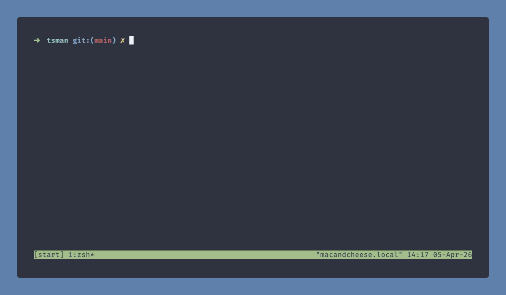

<div align="center">

# tsman

[](https://github.com/TecuceanuGabriel/tsman/actions)
[](https://crates.io/crates/tsman)
[](https://crates.io/crates/tsman)
[](https://github.com/tmux/tmux)
[](LICENSE)

a feature-rich session manager for tmux

[Features](#features) • [Requirements](#requirements) • [Installation](#installation) • [Usage](#usage) •
[Menu keybindings](#menu-keybindings) • [Configuration](#configuration) • [Notes](#notes)



</div>

## Features

- Quickly save/restore/delete/edit/reload tmux sessions.
- Work with layouts - reusable window/pane structure templates that can be applied to any working directory.
- Manage sessions and layouts from the interactive TUI menu:
  - Use keybindings to trigger actions (Save/Open/Edit/Delete/Rename/Kill/Reload).
  - Toggle between sessions and layouts list views.
  - Create new sessions from layout templates directly in the menu.
  - Fuzzy-find sessions and layouts (powered by
    [fuzzy-matcher](https://github.com/skim-rs/fuzzy-matcher)).
  - View session/layout structure in the preview panel.
- Shell completions for bash, zsh, and fish.

## Requirements

- tmux >= [v3.2](https://github.com/tmux/tmux/releases/tag/3.5a)
  (recommended for the display-popup feature).

## Installation

```bash
cargo install tsman
```

## Usage

Each subcommand has a short alias shown in parentheses.

### Sessions

#### Save current session (`s`)

```bash
tsman save <session_name> # save with the specified name
tsman save                # save with the current session name
```

#### Open a session (`o`)

```bash
tsman open <session_name>
```

#### Edit a session config file (`e`)

Opens the config file in `$EDITOR`.

```bash
tsman edit <session_name> # edit the specified session
tsman edit                # edit the current session
```

#### Reload a session (`r`)

Kill the running session and recreate it from its saved config. The session must be both active and saved.

```bash
tsman reload <session_name>
tsman reload # reload the current session
```

#### Delete a session config file (`d`)

```bash
tsman delete <session_name>
```

### Layouts

Layouts capture a session's window/pane structure without working directories, so you can reuse the same arrangement across different projects.

#### Save current session as a layout (`layout s`)

```bash
tsman layout save <layout_name> # save with the specified name
tsman layout save               # save with the current session name
```

#### Create a session from a layout (`layout c`)

All panes in the new session start in the given working directory.

```bash
tsman layout create <layout_name> <work_dir>               # session name defaults to layout name
tsman layout create <layout_name> <work_dir> <session_name> # use a custom session name
```

#### List saved layouts (`layout ls`)

```bash
tsman layout list
```

#### Edit a layout config file (`layout e`)

```bash
tsman layout edit <layout_name>
```

#### Delete a layout (`layout d`)

```bash
tsman layout delete <layout_name>
```

### Menu (`m`)

Open the interactive TUI menu.

```bash
tsman menu
tsman menu --preview              # start with the preview pane on
tsman menu --ask-for-confirmation # prompt before deleting
tsman menu -p -a                  # shorthand for both flags
```

### Shell completions (`c`)

```bash
tsman completions bash > ~/.local/share/bash-completion/completions/tsman
tsman completions zsh > ~/.zfunc/_tsman
tsman completions fish > ~/.config/fish/completions/tsman.fish
```

## Menu keybindings

Navigation:

| Keybinding     | Action               |
| -------------- | -------------------- |
| `Esc` / `C-c`  | Exit menu            |
| `Up` / `C-p`   | Select previous item |
| `Down` / `C-n` | Select next item     |

Session actions:

| Keybinding | Saved session                         | Unsaved session |
| ---------- | ------------------------------------- | --------------- |
| `Enter`    | Open session                          | Open session    |
| `C-s`      | -                                     | Save session    |
| `C-e`      | Edit config file                      | -               |
| `C-d`      | Delete config file                    | Kill session    |
| `C-k`      | Kill session                          | Kill session    |
| `C-r`      | Rename session and update config file | Rename session  |
| `C-o`      | Reload session from saved config      | -               |

Layout actions (when in layouts view):

| Keybinding | Action                           |
| ---------- | -------------------------------- |
| `Enter`    | Create a new session from layout |
| `C-e`      | Edit layout config file          |
| `C-d`      | Delete layout                    |
| `C-r`      | Rename layout                    |

UI controls:

| Keybinding   | Action                      |
| ------------ | --------------------------- |
| `C-l`        | Toggle sessions/layouts     |
| `C-t`        | Toggle preview pane         |
| `C-h`        | Toggle help popup           |
| `C-w`        | Delete last word from input |
| `C-u`        | Delete to line start        |
| `Shift-Up`   | Scroll preview up           |
| `Shift-Down` | Scroll preview down         |

Workdir completion controls (in layout creation):

| Keybinding          | Action                     |
| ------------------- | -------------------------- |
| `Tab` / `C-n`       | Open dropdown / cycle next |
| `Shift-Tab` / `C-p` | Cycle prev                 |
| `Up` / `Down`       | Prev / next                |

Confirmation popup:

| Keybinding              | Action  |
| ----------------------- | ------- |
| `y` / `Y` / `Enter`     | Confirm |
| `n` / `N` / `Esc` / `q` | Abort   |

Help popup:

| Keybinding                            | Action |
| ------------------------------------- | ------ |
| `C-h` / `C-c` / `Esc` / `q` / `Enter` | Close  |

## Configuration

You can add keybindings/aliases to your tmux/shell config for faster usage.

`~/.tmux.conf`:

```bash
# open menu in a tmux popup with preview pane and delete confirmation on
# note: requires tmux v3.2+
bind -r f display-popup -E -w 80% -h 80% "tsman menu -p -a"
bind -r C-s run-shell "tsman save"
```

`~/.zshrc`:

```bash
alias mux-fd="tsman menu -p -a"
```

## Notes

- `$EDITOR` must be set to use the edit command.
- Session names must be 1-30 characters, alphanumeric plus `-` and `_`.
- Config files are stored as YAML - you can edit them manually for fine-grained control.

## Contributing

- Please see [CONTRIBUTING.md](./.github/CONTRIBUTING.md)

## Acknowledgements

- [tmuxinator](https://github.com/tmuxinator/tmuxinator)
- [ThePrimeagen's tmux-sessionizer](https://github.com/ThePrimeagen/tmux-sessionizer)
