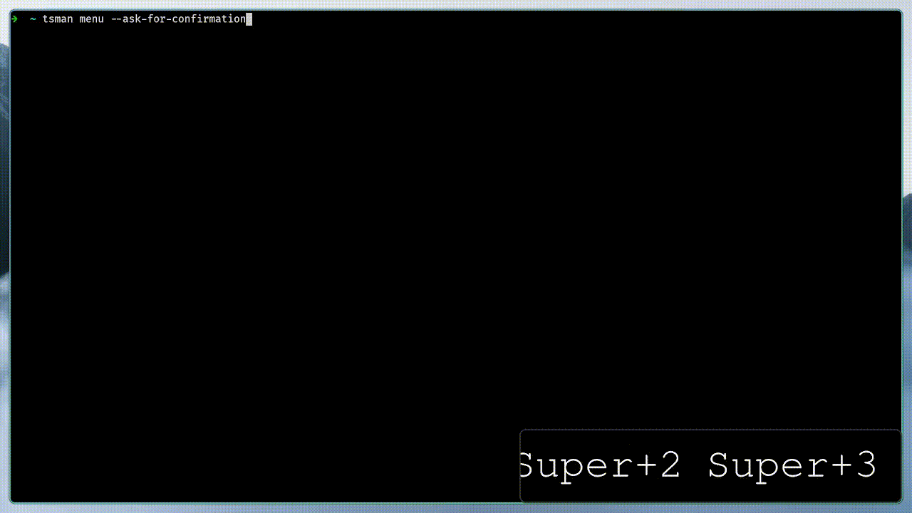
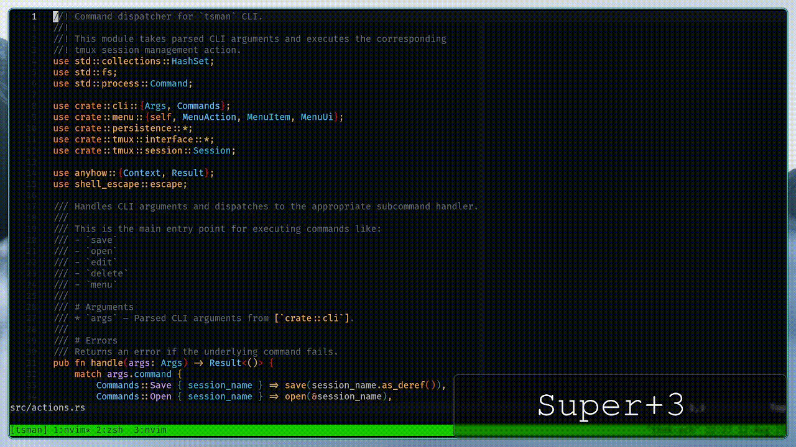

<div align="center">

# tsman

A lightweight session manager for tmux

[](https://github.com/TecuceanuGabriel/tsman/actions)
[](https://crates.io/crates/tsman)
[](https://crates.io/crates/tsman)
[](https://github.com/tmux/tmux)
[](LICENSE)

[Features](#features) • [Installation](#installation) • [Usage](#usage) •
[Configuration](#configuration)


_Navigation_


_Editing_


_Save/Delete_

</div>

## ✨Features

- Quickly save/restore/delete tmux sessions.
- Manually tweak session config files for better control.
- Manage sessions from the interactive TUI menu:
  - Use the keybindings to trigger actions (Save/Open/Edit/Delete).
  - Fuzzily find sessions (powered by
    [fuzzy-matcher](https://github.com/skim-rs/fuzzy-matcher)).
  - View the sessions structure in the preview panel.

## ⚡Requirements

- tmux >= [v3.2](https://github.com/tmux/tmux/releases/tag/3.5a)
  (recommended for the display-popup feature).

## 📦Installation

```bash
cargo install tsman
```

## 🚀Usage

### Save current session

```bash
tsman save <session_name> # uses the specified name
tsman save # uses the current name of the session
```

### Open a session

```bash
tsman open <session_name>
```

### Edit a session config file

The file is opened for editing in `$EDITOR`.

```bash
tsman edit <session_name> # edit the config file of the specified session
tsman edit # edit the config file of the current session
```

### Delete a session config file

```bash
tsman delete <session_name>
```

### Open a menu that contains all saved sessions

```bash
tsman menu
tsman menu --preview # open the menu with the preview pane on
tsman menu --ask-for-confirmation # Open a confirmation popup when deleting
```

## ⌨️Menu keybindings:

Navigation:

| command              | action               |
| -------------------- | -------------------- |
| `Esc` / `C-c`        | Exit menu            |
| `Up arrow` / `C-p`   | Select previous item |
| `Down arrow` / `C-n` | Select next item     |

Session actions:

| command | saved session action                   | unsaved session action |
| ------- | -------------------------------------- | ---------------------- |
| `C-e`   | Edit config file of selected session   | -                      |
| `C-d`   | Delete config file of selected session | Kill session           |
| `C-s`   | -                                      | Save session           |
| `C-k`   | Kill session                           | Kill session           |
| `Enter` | Open session                           | Open session           |

UI Controls:

| command | action                                    |
| ------- | ----------------------------------------- |
| `C-t`   | Toggle the visibility of the preview pane |
| `C-h`   | Toggle the visibility of the help popup   |
| `C-w`   | Delete last word from input               |

Confirmation Popup:

| command                 | action  |
| ----------------------- | ------- |
| `y` / `Y` / `Enter`     | Confirm |
| `n` / `N` / `Esc` / `q` | Abort   |

Help Popup:

| command                               | action |
| ------------------------------------- | ------ |
| `C-h` / `C-c` / `Esc` / `q` / `Enter` | Close  |

## 🔧Configuration

You can add keybindings/aliases to your tmux/shell config file for faster usage.

Example config:

`~/.tmux.conf`:

```bash
# open menu in a tmux popup with preview pane and delete confirmation on
# note: requires tmux v3.2+
bind -r f display-popup -E -w 80% -h 80% "tsman menu -p -a"
bind -r C-s run-shell "tsman save"
```

`~/.zshrc`:

```bash
alias mux-fd="tsman menu -p -a"
```

If you want to set up a custom location to store session config files set the
`TSMAN_CONFIG_STORAGE_DIR` env variable. You can add the following line to
your shell config file to make it persistent:

```bash
export TSMAN_CONFIG_STORAGE_DIR="$HOME/mux-sessions"
```

## 🗒️Notes

- `$EDITOR` must be set to use the edit command.
- the session config files are saved by defult in `~/.config/.tsessions/`.

## 🤝Contributing

- Please see [CONTRIBUTING.md](./.github/CONTRIBUTING.md)

## 🙏Acknowledgements

- [tmuxinator](https://github.com/tmuxinator/tmuxinator)
- [ThePrimeagen's tmux-sessionizer](https://github.com/ThePrimeagen/tmux-sessionizer)
